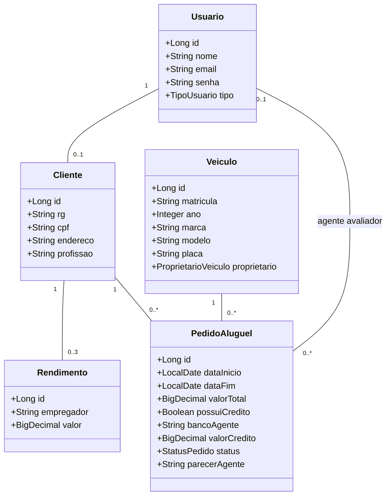

# Diagrama de Classes

```mermaid
classDiagram
class Usuario {
  +Long id
  +String nome
  +String email
  +String senha
  +TipoUsuario tipo
}
class Cliente {
  +Long id
  +String rg
  +String cpf
  +String endereco
  +String profissao
}
class Rendimento {
  +Long id
  +String empregador
  +BigDecimal valor
}
class Veiculo {
  +Long id
  +String matricula
  +Integer ano
  +String marca
  +String modelo
  +String placa
  +ProprietarioVeiculo proprietario
}
class PedidoAluguel {
  +Long id
  +LocalDate dataInicio
  +LocalDate dataFim
  +BigDecimal valorTotal
  +Boolean possuiCredito
  +String bancoAgente
  +BigDecimal valorCredito
  +StatusPedido status
  +String parecerAgente
}
Usuario "1" -- "0..1" Cliente
Cliente "1" -- "0..3" Rendimento
Cliente "1" -- "0..*" PedidoAluguel
Veiculo "1" -- "0..*" PedidoAluguel
Usuario "0..1" -- "0..*" PedidoAluguel : agente avaliador
```
